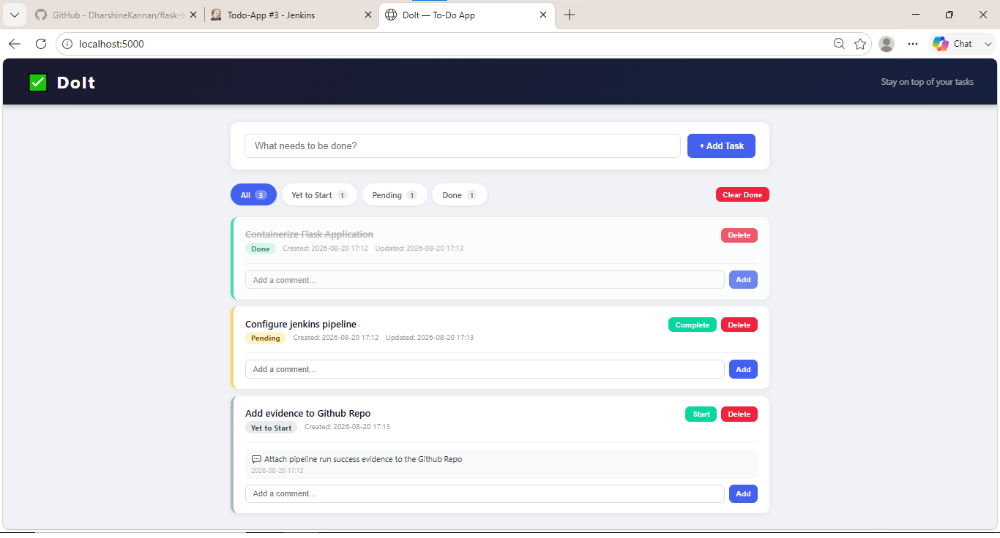
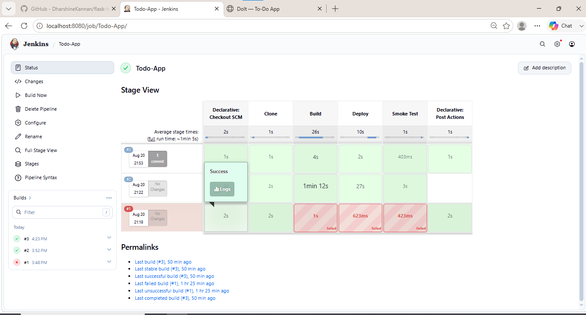
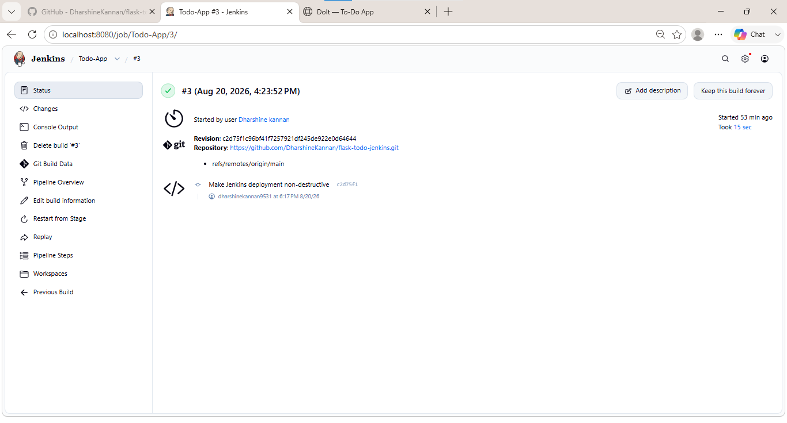

# Flask To-Do App with Docker Compose and Jenkins

A Flask and PostgreSQL task-management application packaged with Docker Compose, with a Jenkins pipeline for build, deployment, and smoke-test automation. Tasks and comments are stored in a persistent Docker named volume.

## Features

- Create, edit, advance, filter, and delete tasks
- Add, edit, and delete comments associated with a task
- Persist application data in PostgreSQL
- Report application and database readiness through `GET /health`
- Build and run the application and database with Docker Compose
- Serve the Flask application with Gunicorn as an unprivileged container user
- Define Jenkins pipeline stages for checkout, image build, deployment, and smoke testing

## Project evidence

### Application interface

The interface below demonstrates tasks in all three workflow states and a nested task comment.



### Verified Jenkins pipeline

Jenkins Build #3 completed Checkout, Clone, Build, Deploy, Smoke Test, and Post Actions successfully against commit [`c2d75f1`](https://github.com/DharshineKannan/flask-todo-jenkins/commit/c2d75f1c96bf41f7257921df245de922e0d64644).





The corresponding [Jenkins console output](docs/console-output.txt) records the cached Docker build, healthy PostgreSQL dependency, successful `GET /health` response, credential cleanup, and final `SUCCESS` result. The database credential value is masked in the transcript.

## Prerequisites

- Docker Desktop, or Docker Engine with Docker Compose v2
- Git

## Start the application

1. Clone the repository and enter it:

   ```bash
   git clone https://github.com/DharshineKannan/flask-todo-jenkins.git
   cd flask-todo-jenkins
   ```

2. Create your local environment file:

   macOS/Linux:

   ```bash
   cp .env.example .env
   ```

   Windows PowerShell:

   ```powershell
   Copy-Item .env.example .env
   ```

3. Open `.env` and replace the example password with a strong local password:

   ```dotenv
   DB_USER=tododb_user
   DB_PASSWORD=replace_with_a_strong_password
   DB_NAME=tododb
   ```

   Do not commit `.env`. It is already excluded by `.gitignore` and `.dockerignore`.

4. Create the external network used by the application and Jenkins. This is a one-time command:

   ```bash
   docker network create shared-net
   ```

   If Docker reports that `shared-net` already exists, continue to the next step.

5. Build and start the containers:

   ```bash
   docker compose up --build -d
   ```

6. Open <http://localhost:5000>.

## Verify container health

```bash
docker compose ps
curl http://localhost:5000/health
```

The health endpoint returns the following response after Flask can connect to PostgreSQL:

```json
{"status":"healthy"}
```

To follow the application logs:

```bash
docker compose logs -f web db
```

## Stop the application

Stop and remove the containers while retaining database data:

```bash
docker compose down
```

To also permanently delete the PostgreSQL named volume and all stored tasks:

```bash
docker compose down --volumes
```

## Configuration

Docker Compose reads these variables from `.env`:

| Variable | Purpose | Example |
| --- | --- | --- |
| `DB_USER` | PostgreSQL user | `tododb_user` |
| `DB_PASSWORD` | PostgreSQL password; required | `replace_with_a_strong_password` |
| `DB_NAME` | PostgreSQL database | `tododb` |

`DB_USER` and `DB_NAME` have Compose defaults matching `.env.example`. `DB_PASSWORD` is intentionally required, so Compose stops with a clear error when it is missing.

## Troubleshooting

### PostgreSQL does not recover after a failed initialization

Current Compose configuration requires `DB_PASSWORD` before starting PostgreSQL. If the `pg_data` volume was created by an earlier failed or partial database initialization, the database may continue restarting or remain unhealthy after the password is corrected. Check the database logs first:

```bash
docker compose logs db
```

For a disposable local environment, remove the failed database volume, confirm that `.env` contains a valid `DB_PASSWORD`, and recreate the stack:

```bash
docker compose down --volumes
docker compose up --build -d
```

This permanently deletes every task and comment stored in `pg_data`. Do not remove the volume when its data must be preserved; back it up and diagnose the PostgreSQL logs instead.

## Jenkins pipeline

`Jenkinsfile` defines the following stages:

1. Clone the `main` branch from GitHub.
2. Build the application image with Docker Compose.
3. Create the persistent `shared-net` network if needed and attach the Jenkins container.
4. Reconcile the Compose deployment, recreating only services whose image or configuration changed.
5. Run an HTTP smoke test.

The Jenkins environment must have:

- Access to a Docker daemon
- Docker Compose v2 (`docker compose`)
- A Jenkins secret-text credential with the ID `db-password`
- Network access to GitHub

`Dockerfile.jenkins` is the custom Jenkins image definition intended to provide the Docker CLI. The Jenkins runtime must also be configured with access to the host Docker socket or another Docker daemon before the pipeline can build or deploy containers.

The application uses the external Docker network `shared-net`. The pipeline creates it when missing, checks whether the executing Jenkins container is already attached, and connects it only when necessary. An actual inspection or connection error fails the deployment instead of being ignored. Because Compose does not own the external network, it survives deployment cycles and Jenkins can resolve the `web` service during the smoke test.

Deployment uses `docker compose up -d --remove-orphans` rather than stopping the complete stack first. Compose recreates the changed web service while leaving PostgreSQL running when its configuration has not changed. If the pipeline fails, Jenkins preserves the deployment and prints container status plus recent service logs for diagnosis. The temporary `.env` credential file is removed after every run.

The smoke test retries `http://web:5000/health` within a bounded 30-second window. Each request has a three-second connection timeout and a five-second total timeout, and the stage only succeeds when it receives `{"status":"healthy"}`. Because `/health` executes `SELECT 1` through SQLAlchemy, it checks both the Gunicorn process and PostgreSQL connectivity. A pipeline-level ten-minute timeout prevents source checkout, image pulls, or builds from blocking an executor indefinitely.

## Infrastructure choices

- **Docker Compose instead of separate Docker commands:** the application needs a web service, PostgreSQL, health-based startup ordering, persistent storage, environment configuration, and shared networking. Compose keeps that multi-container configuration declarative and repeatable.
- **Jenkins instead of GitHub Actions:** this project demonstrates a self-hosted pipeline that builds and deploys through the Docker daemon on the deployment host. It provides hands-on experience with Jenkins credentials, pipeline stages, container networking, and deployment smoke tests.

## Project structure

```text
.
|-- .dockerignore
|-- .env.example
|-- .gitignore
|-- app.py
|-- Dockerfile
|-- Dockerfile.jenkins
|-- Jenkinsfile
|-- docker-compose.yml
|-- requirements.txt
|-- wsgi.py
|-- docs/
|   |-- Pipeline-Status-Page.png
|   |-- Pipeline-success-run.png
|   |-- Todo-App-UI.png
|   `-- console-output.txt
`-- templates/
    `-- index.html
```

The `pg_data` named volume persists PostgreSQL data between container restarts and rebuilds.
